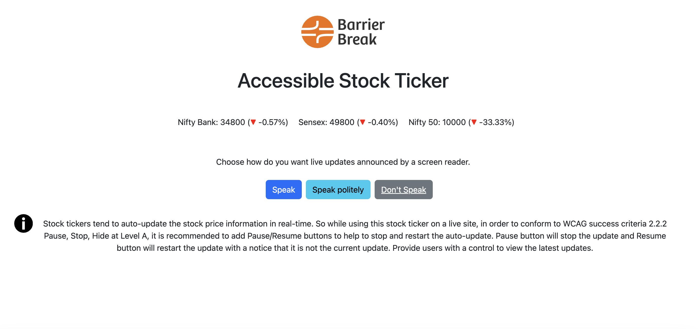

# Accessible Stock Ticker
## Introduction
The accessible stock ticker web application presented here offers updates (not real-time) on stock market data in an accessible and user-friendly format. Designed with inclusivity in mind, this application integrates various accessibility features to ensure that users of all abilities can access and interact with the information effortlessly. From dynamic content updates to customizable announcement preferences, this ticker provides a seamless experience for investors, financial analysts, and anyone interested in staying informed about stock market trends. With its intuitive design and robust accessibility features, this stock ticker sets a new standard for inclusivity in financial data visualization.

## Accessibility Features
The provided accessible stock ticker web application demonstrates several accessibility features to ensure usability for a diverse range of users:

- **Semantic HTML:** Utilizes semantic elements for better structure and organization.
- **ARIA Roles and Attributes:** Includes ARIA attributes for enhanced accessibility, such as live region updates and hidden text for screen reader users.
- **Focus Styles:** Implements clear focus styles for improved keyboard navigation.
- **Dynamic Content:** Updates stock information dynamically, ensuring timely updates for users.
- **User Control:** Allows users to customize announcement preferences, enhancing user experience.
- **Visual Design:** Offers a visually appealing design with good color contrast for readability.
To further improve accessibility, considerations include keyboard operability, screen reader compatibility, contrast ratios and alternative text for graphics. These enhancements ensure the application is accessible and usable for all users.

## Keyboard Support
|  Key |  Function|
|---|---|
| Tab  |  Navigate between interactive elements in the order they appear in the HTML document. |
| Shift + Tab  | Navigates to the previous interactive element.|
|  Down arrow |  Not explicitly defined in the provided code, but typically used to navigate through lists. In this context, they could potentially be used to navigate between different stock information items or buttons.|
|  Up arrow | When focus is on the accordion button, the focus moves to the previous header.It also reads content inside the previous accordion panel if expanded.|
|  Enter or Spacebar | Activate (click) the currently focused button, triggering its associated action. For example, pressing Enter on the "Speak" button announces the stock values audibly.|

## ARIA Attributes

| Attributes  |  Description |
|---|---|
|  aria-label |  Provides a text label for the <svg> graphic.|
|  aria-live |  Indicates that the element's content (the stock ticker) is live and should be announced to the user, even if they are in the middle of using a screen reader. It ensures that users receive real-time updates without having to refresh the page.|
|  aria-atomic | Specifies that the entire contents of the live region (stock ticker) should be announced when any part of it changes. This attribute ensures that screen reader users receive complete and coherent updates, even if only a portion of the content changes.|
|  aria-hidden | Indicates that the element (such as the up and down arrows used for visual representation) is not relevant or meaningful for screen reader users. It ensures that screen readers ignore these elements, preventing them from being announced redundantly.|
	
## Browser and Screen reader Support

| Operating System | Browser  | Screen Reader  | Compatible  |
|---|---|---|---|
|  Windows |  Chrome | JAWS  | Yes  |
|  Windows | Edge  |  JAWS | Yes  |
|  Windows | Firefox  | NVDA  | Yes  |
|  Windows |  IE 11 |  JAWS |  Yes |
| Mac  |  Safari |  Voiceover | Yes  |
|  IOS |  Safari | Voiceover  | Yes  |
|  Android |Chrome   | Talkback  | Yes  |
 		 	
			
			
			
	 		
			
			
			

